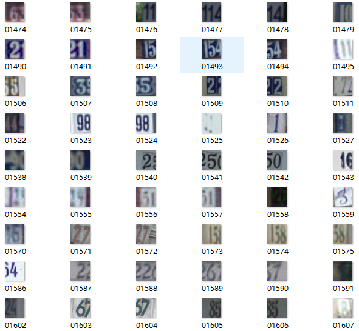
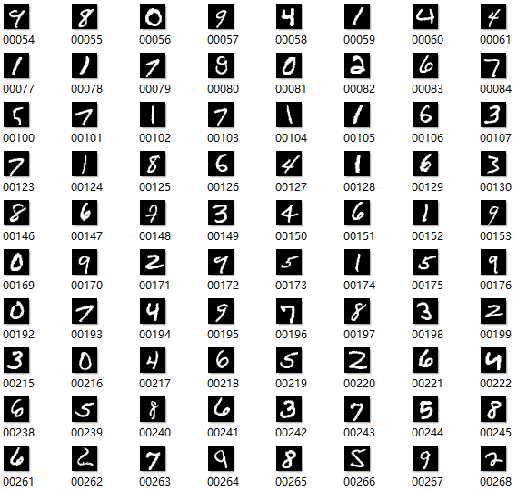

# Save images of SVHN and MNIST
---

## Function
Extract data from .mat file and binary file of SVHN and MNIST, respectively. Then transform data to images and save in folders.

## Source
1. SVHN dataset: http://ufldl.stanford.edu/housenumbers/

2. MNIST dataset: http://yann.lecun.com/exdb/mnist/

## Results
1. SVHN

2. MNIST

## Reference
[1] Python读取mnist: http://www.jianshu.com/p/81f8ca1b722f

[2] caffe学习(3):SVHN on caffe: https://zhuanlan.zhihu.com/p/22234821